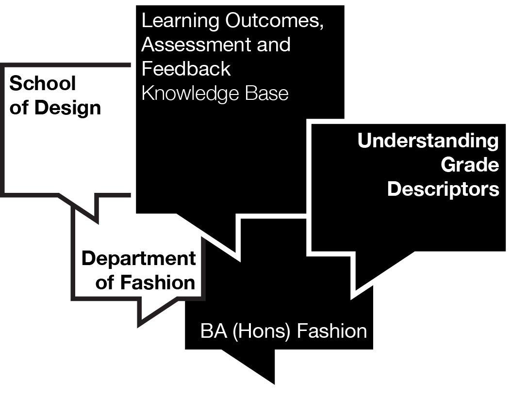

# Kingston University London, Kingston School of Art, School of Design.
Department of Fashion, BA (Hons) Fashion program - Understanding Grade Descriptors
© 2025 Kingston University

## Overview

This interactive web application helps students understand the grade descriptors used to assess their work on the BA (Hons) Fashion program at Kingston School of Art, Kingston University. The tool visually presents grade descriptors across different assessment bands, helping students identify specific areas for improvement to achieve higher grades.

## Features

- **Interactive Grade Selection**: Students can click on different grade bands (Distinction, First Class, Upper Second, etc.) to see detailed criteria
- **Colour-Coded Bands**: Each grade has a distinctive visual identity to reinforce understanding
- **Improvement Guidelines**: Specific advice on how to move up to the next grade band
- **Complete Grading Matrix**: Comprehensive view of all grade bands and criteria in a single table
- **Mobile-Responsive Design**: Works across desktop, tablet, and mobile devices
- **Accessibility-Focused**: Designed with assistive technologies in mind

## Learning Outcomes Mapped to Assessment

The tool maps each grade descriptor to the four key learning outcome areas of the School of Design Curriculum Framework:

1. **Research and Analysis**: Critical examination of context and interpretation of sources
2. **Experimentation and Practice**: Testing of subject, thinking through making, technique, risk taking and problem solving
3. **Communication and Presentation**: Realisation of intentions and skill in appropriate media with awareness of audience needs
4. **Personal and Professional Development**: Planning, time-management, commitment & subject engagement

## Technical Implementation

- Built with React for interactivity
- Uses Tailwind CSS for styling
- No backend dependencies - runs entirely in the browser
- Single HTML file deployment for ease of use in Canvas VLE

## How to Use

### For Students

1. Visit the page through your Canvas VLE
2. Click on different grade bands to understand assessment criteria
3. Read the "How to move up to the next grade band" section for targeted advice
4. Use the "Complete Grading Matrix" button to see a comprehensive overview

### For Instructors

1. Fork this repository or download the HTML file
2. Modify the content in the grades array to match your program's assessment criteria
3. Update the color scheme if needed to match your institutional branding
4. Deploy to your Canvas instance or other web hosting

## Customization

The tool can be adapted for different courses by modifying:

- Grade bands and descriptors in the `grades` array
- Color scheme (currently using Kingston School of Art branding)
- Assessment criteria and improvement advice

## Installation

1. Clone this repository:

https://github.com/MounseyWood/Understanding-Grade-Descriptors-v4

2. Open the HTML file in a web browser or upload to your Canvas instance

## Requirements

- Modern web browser with JavaScript enabled
- No server-side requirements

## Credits

Author: Matthew Mounsey-Wood
Email: m.mounsey-wood@kingston.ac.uk
Created: April 29, 2025
Last Modified: April 29, 2025
Version: 1.0

Developed for Kingston School of Art, BA (Hons) Fashion Program – Learning Outcomes, Feedback and Assessment Knowledge Base.

© 2025 Kingston University

## License

This project is licensed under the MIT License - see the LICENSE file for details.